<p align="center">
  <strong>Samsung PRISM GenAI Hackathon 3.0 (2026–27)</strong><br/>
  <em>Theme 1 — Agentic Code Architecture Intelligence</em>
</p>

<h1 align="center">🧠 Agentic Code Intelligence Engine</h1>

<p align="center">
  An explainable, CPU-optimized agentic code retrieval engine that combines<br/>
  AST-symbolic indexing, call-graph traversal, and hybrid dense-sparse search<br/>
  to locate, rank, and structurally verify code snippets across codebases.
</p>

<p align="center">
  
  
  
  
  
  
</p>

---

## Table of Contents

- [Problem Statement](#-problem-statement)
- [Architecture Overview](#-architecture-overview)
- [Key Features](#-key-features)
- [Interactive Diagrams](#-interactive-diagrams)
- [Application Screenshots](#-application-screenshots)
- [Video Demonstrations](#-video-demonstrations)
- [Tech Stack](#-tech-stack)
- [Repository Structure](#-repository-structure)
- [Getting Started](#-getting-started)
- [API Reference](#-api-reference)
- [Benchmark Results](#-benchmark-results)
- [Team & Modules](#-team--modules)

---

## 🔍 Problem Statement

Modern large codebases easily overwhelm standard LLM context windows. Naive vector RAG approaches suffer from **semantic drift** and lack awareness of code execution paths, syntax boundaries, and caller-callee hierarchies.

**Our solution** implements a multi-stage retrieval architecture that:

1. **Chunks code along AST boundaries** — not arbitrary token windows — preserving function, class, and method integrity.
2. **Fuses dense + sparse retrieval** via Reciprocal Rank Fusion (RRF) for both semantic understanding and lexical precision.
3. **Traverses call graphs** using NetworkX to answer structural and temporal queries (*"which function calls X before Y?"*).
4. **Runs a bounded agent state machine** (`SEARCH` → `READ` → `EXPAND` → `RERANK`) that iteratively follows dependency edges and verifies relevance.
5. **Explains every result** with factual evidence chains, score breakdowns, and confidence levels.

---

## 🏗 Architecture Overview

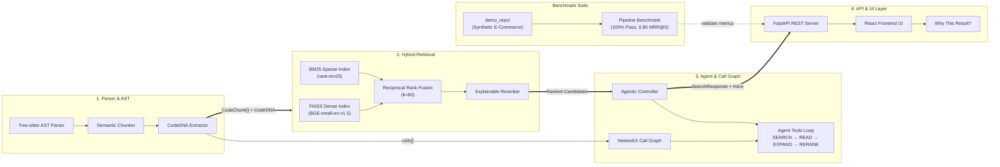

> 📊 **Interactive versions of these diagrams** are available in `docs/diagrams/` (see [Interactive Diagrams](#-interactive-diagrams) below).

---

## ✨ Key Features

### 🌳 AST-Aware Semantic Chunking
Code is parsed with **Tree-sitter** and chunked strictly along syntactic boundaries (functions, classes, methods). Each chunk carries a **CodeDNA** fingerprint — parameters, return types, call signatures, imports — enabling symbol-level retrieval no keyword search can match.

### 🔗 Hybrid Dense + Sparse Search with RRF
Dual-index retrieval combining:
- **Dense**: `bge-small-en-v1.5` sentence embeddings indexed with FAISS
- **Sparse**: BM25 lexical inverted index via `rank-bm25`
- **Fusion**: Reciprocal Rank Fusion (k=60) for robust ranking

### 🕸 Call-Graph Traversal & Structural Queries
A **NetworkX DiGraph** models the entire codebase's caller-callee relationships. The engine answers structural temporal predicates like:
> *"Find functions that call `sanitize_input` before `execute_query`"*

### 🤖 Bounded 4-Stage Agent State Machine
An agentic controller executes a bounded multi-step workflow:

```
SEARCH → READ → EXPAND → RERANK
```

Each step is traced and visible in the UI's **4-Stage Trace Timeline**, providing full transparency into how results are found.

### 💡 Explainable Results with Evidence Chains
Every result includes:
- **Score Breakdown**: Semantic, BM25, Symbol, and Graph scores
- **Evidence Factors**: Factual descriptions of *why* each factor contributed
- **Confidence Level**: `HIGH` / `MEDIUM` / `LOW` classification
- **"Why This Result?"** modal with complete attribution

### 📡 Live Repository Indexing
Point the engine at **any local Python repository** and index it in real-time. The UI supports swapping repositories on-the-fly without restarting the server.

### 🖥 Interactive Code Intelligence Cockpit
A React-powered split-pane UI featuring:
- **Monaco Editor** with syntax highlighting and line-range focus
- **Interactive Topology Graph** (XY Flow) with zoom, pan, and node selection
- **Dual Mode Switcher**: Hybrid Search ↔ AST Structural Query
- **Real-time 4-Stage Agent Trace Timeline**

---

## 🗺 Interactive Diagrams

The project includes three interactive, self-contained HTML diagrams (generated with Archify) that you can open directly in your browser:

| Diagram | Description | File |
| :--- | :--- | :--- |
| **System Architecture** | Full component wiring across all 4 pillars, pipeline caching, and evaluation suite | [`architecture.html`](docs/diagrams/architecture.html) |
| **Agent State Machine** | End-to-end 4-stage bounded execution flow (`SEARCH` → `READ` → `EXPAND` → `RERANK`) with UI delivery | [`workflow.html`](docs/diagrams/workflow.html) |
| **Data Pipeline** | Complete 6-stage dataflow from AST chunking → FAISS/BM25 indexes → RRF fusion → FastAPI → React explainability | [`dataflow.html`](docs/diagrams/dataflow.html) |

---

## 📸 Application Screenshots

### System Boot & Cockpit Overview

| Screenshot | Description |
| :--- | :--- |
| 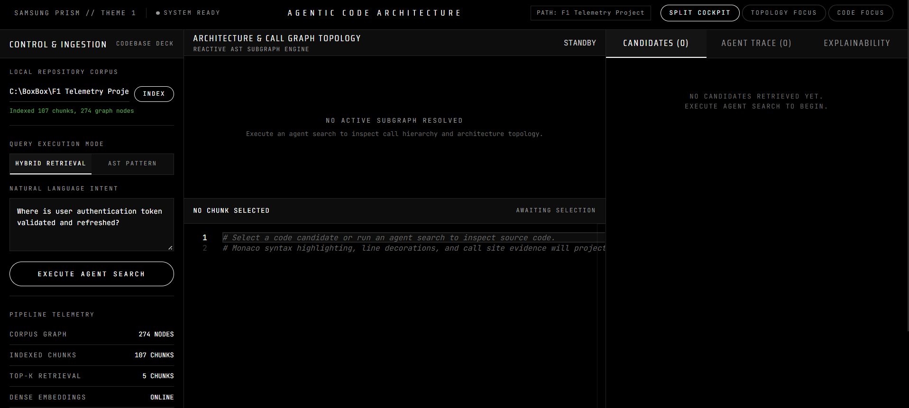 | **System Ready** — Initial cockpit state after backend + frontend launch. Pipeline status, mode selector, and empty canvas. |
| 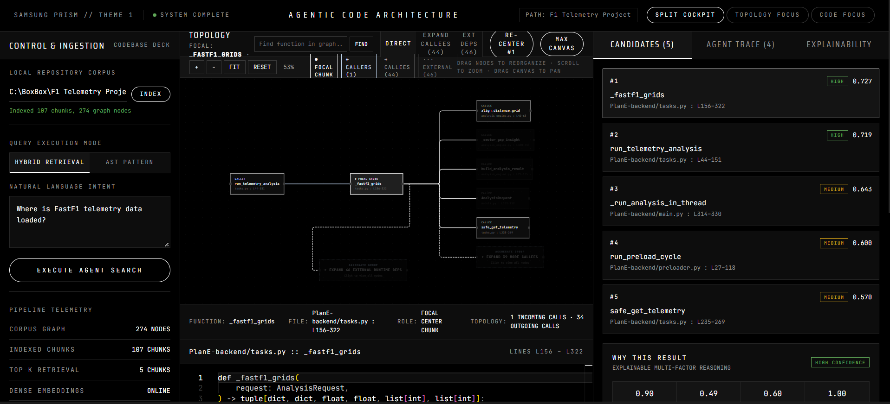 | **Split Cockpit** — Full three-panel layout: search results (left), topology graph (center), Monaco code viewer (right). |

### Hybrid Search in Action

| Screenshot | Description |
| :--- | :--- |
| 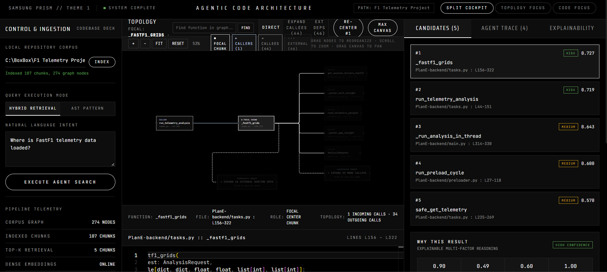 | **Hybrid Search** — Querying a real FastF1 telemetry codebase for data loading functions. Ranked results with score breakdowns. |
| 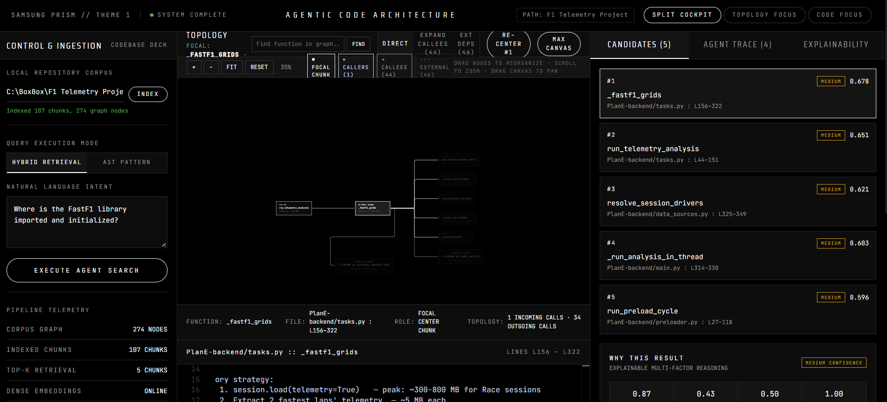 | **Import & Init Query** — Retrieving initialization and import patterns across the indexed repository. |
| 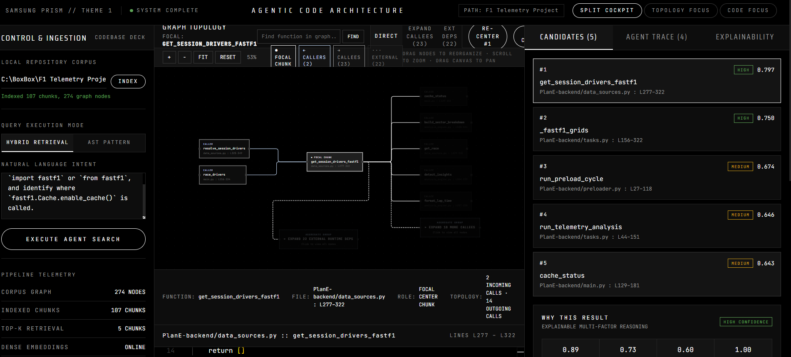 | **Cache Logic Query** — Searching for FastF1 cache management with hybrid dense + sparse retrieval. |
| 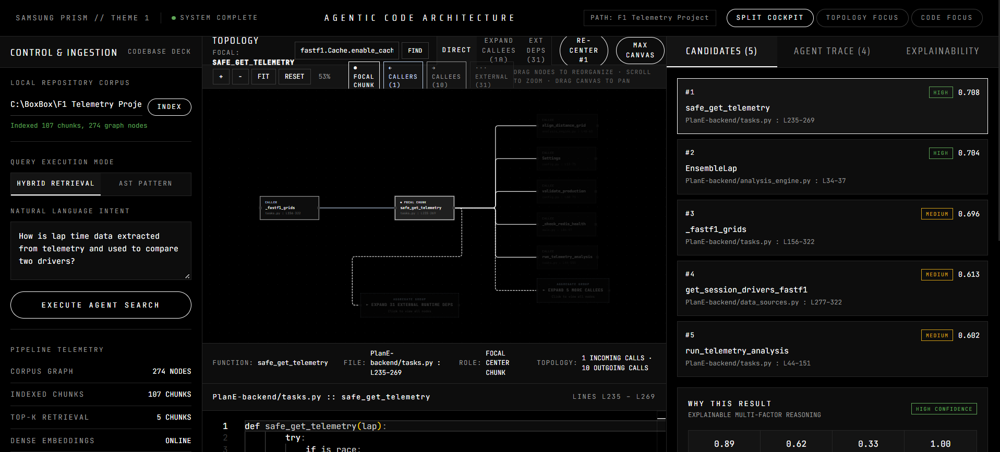 | **Lap Time Extraction** — Finding lap time data extraction logic with ranked results and evidence chains. |

### Topology Graph & Code Navigation

| Screenshot | Description |
| :--- | :--- |
| 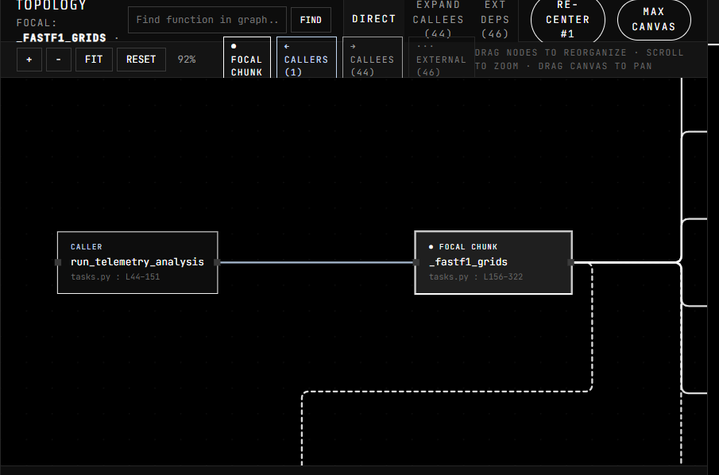 | **Topology Graph** — Interactive call-graph visualization with zoom, pan, and caller-callee edge traversal. |
| 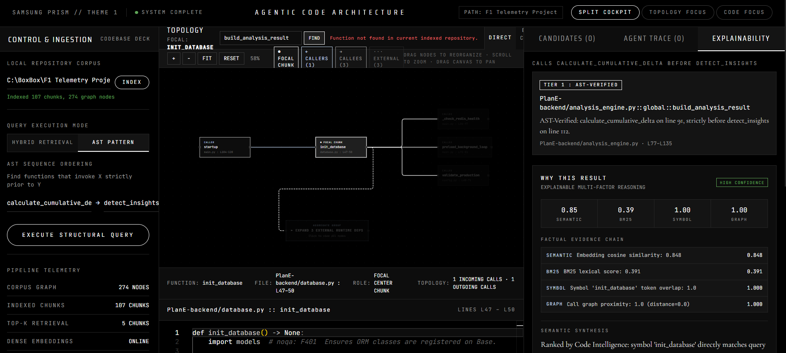 | **Canvas Find** — In-graph node search for navigating large topologies by symbol name. |

### Monaco Code Viewer & Explainability

| Screenshot | Description |
| :--- | :--- |
| 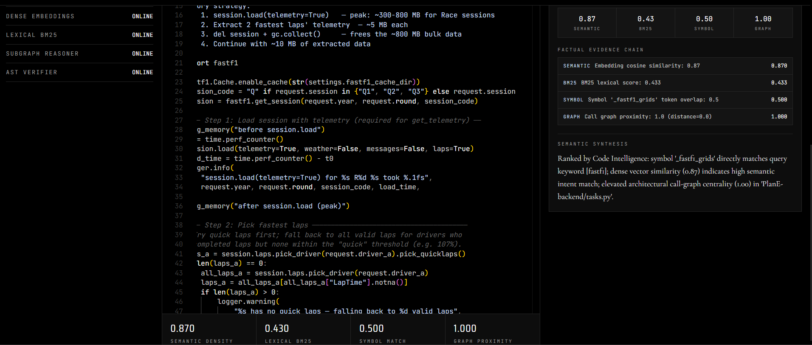 | **Monaco Viewer** — Source code display with syntax highlighting and "Why This Result?" explainability panel. |
| 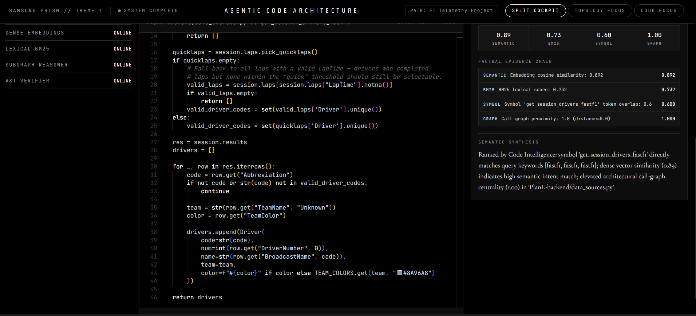 | **Drivers Code** — Viewing driver retrieval logic with full 4-factor score breakdown. |
| 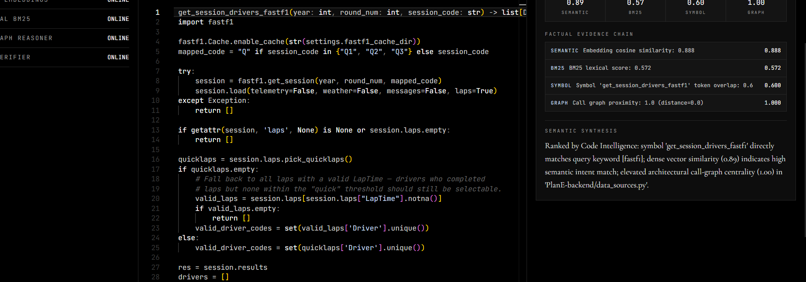 | **Cache Call Highlight** — Line-range focused view of FastF1 cache access patterns. |
| 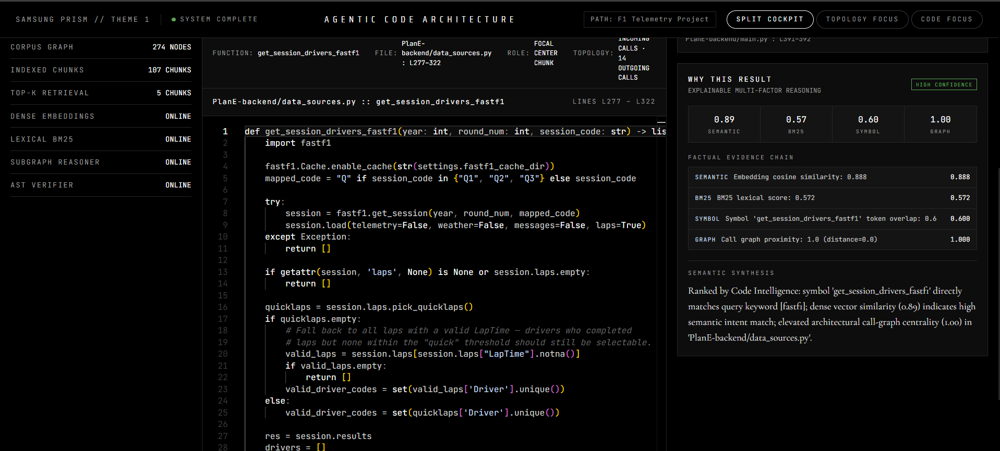 | **Session Drivers** — Monaco view of session and driver processing logic with evidence attribution. |
| 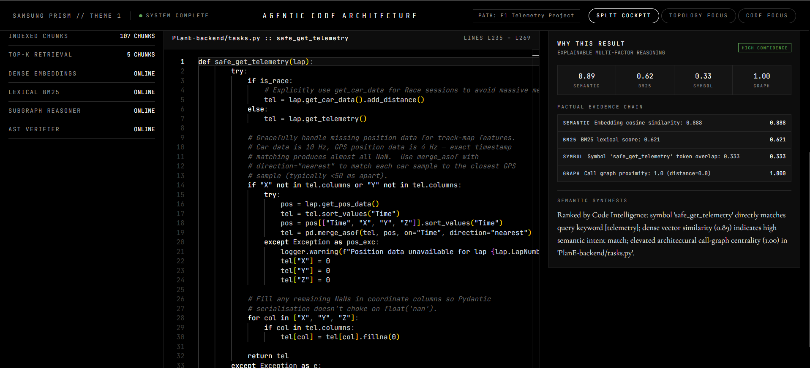 | **Safe Get Telemetry** — Viewing safety-wrapped telemetry retrieval with symbol and graph scores. |
| 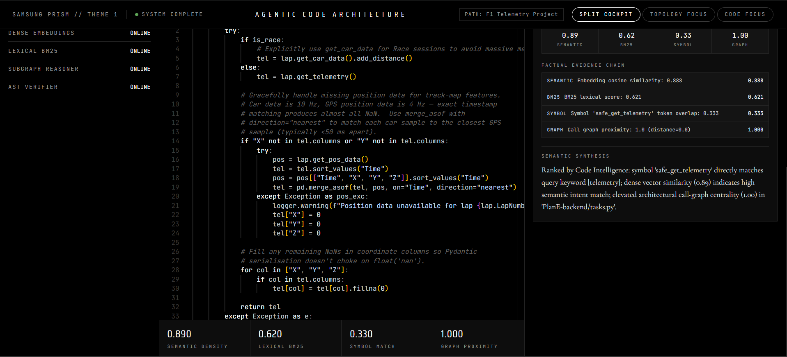 | **Merge Asof Logic** — Telemetry data merge logic with timestamp alignment, viewed in Monaco. |

### Explainability & Evidence

| Screenshot | Description |
| :--- | :--- |
| 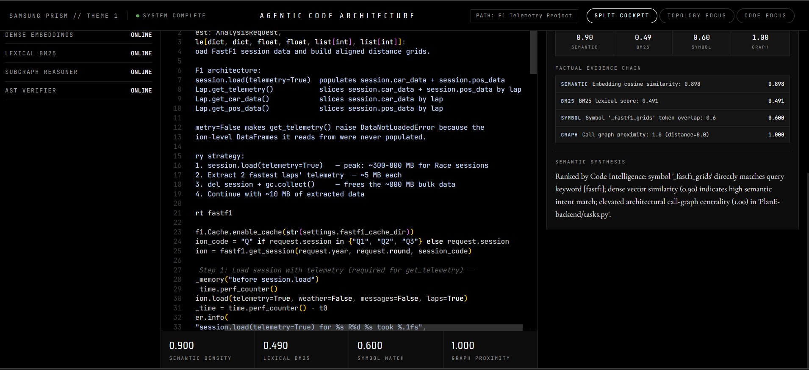 | **Factual Evidence Chain** — Detailed 4-factor breakdown: Semantic, BM25, Symbol, and Graph scoring with natural-language explanations. |

### AST Structural Queries

| Screenshot | Description |
| :--- | :--- |
| 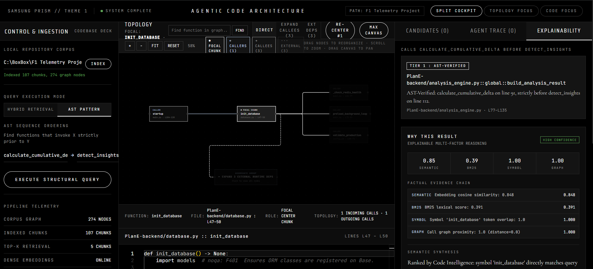 | **AST Structural Query** — Verifying call ordering predicates (*"calls X before Y"*) with structural evidence and confidence scores. |

### Edge Case Handling

| Screenshot | Description |
| :--- | :--- |
| 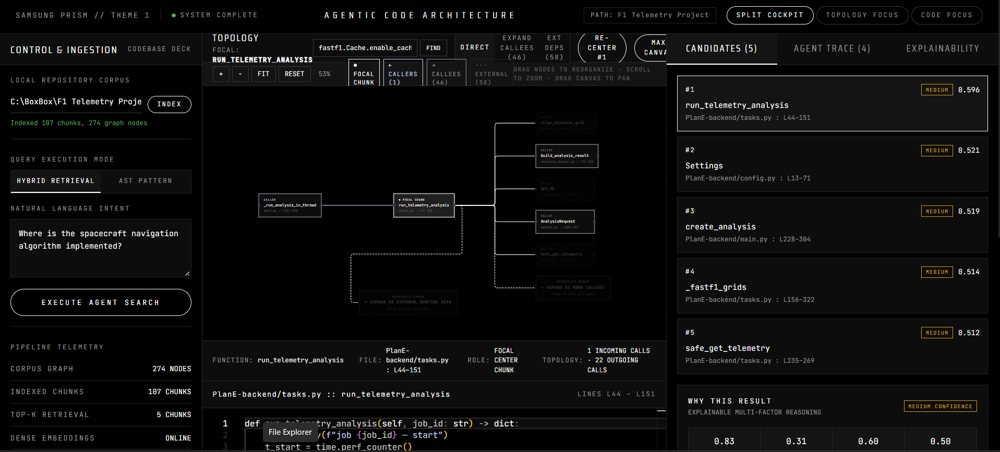 | **Out-of-Domain Query** — Graceful handling of queries unrelated to the indexed codebase, showing normalized low-relevance scores (~0.50). |

---

## 🎬 Video Demonstrations

The following recorded demonstrations are available in `docs/diagrams/Screenshots/`:

| Demo | Description | File |
| :--- | :--- | :--- |
| 🏗 **System Architecture** | Walkthrough of the full architecture diagram — all 4 pillars and their interconnections | [`samsung-prism-agentic-code-intelligence-system.webm`](docs/diagrams/Screenshots/samsung-prism-agentic-code-intelligence-system.webm) |
| 🔄 **Agent Workflow** | End-to-end agent state machine execution from SEARCH through RERANK | [`agentic-code-intelligence-end-to-end-workflow-state-machine.webm`](docs/diagrams/Screenshots/agentic-code-intelligence-end-to-end-workflow-state-machine.webm) |
| 📊 **Data Pipeline** | Complete dataflow from AST parsing to React explainability rendering | [`agentic-code-intelligence-end-to-end-data-pipeline.webm`](docs/diagrams/Screenshots/agentic-code-intelligence-end-to-end-data-pipeline.webm) |

---

## 🛠 Tech Stack

### Backend (Python)

| Component | Technology | Purpose |
| :--- | :--- | :--- |
| AST Parsing | `tree-sitter` + `tree-sitter-python` | Syntax-aware code chunking along function/class boundaries |
| Dense Embeddings | `sentence-transformers` (`bge-small-en-v1.5`) | Semantic vector representations |
| Dense Index | `faiss-cpu` | Approximate nearest neighbor search |
| Sparse Index | `rank-bm25` | Lexical inverted index for keyword matching |
| Call Graph | `networkx` | Directed graph for caller-callee traversal |
| REST API | `fastapi` + `uvicorn` | High-performance async API server |
| Data Contracts | `pydantic` | Request/response validation and serialization |
| Testing | `pytest` | Unit and integration tests |
| Benchmarks | `mteb` | NDCG@10 / MRR evaluation framework |

### Frontend (JavaScript)

| Component | Technology | Purpose |
| :--- | :--- | :--- |
| Framework | `react` 19 | Component-based UI |
| Build Tool | `vite` 8 | Fast dev server and bundler |
| Code Editor | `@monaco-editor/react` | Syntax-highlighted source viewer with line focus |
| Graph Visualization | `@xyflow/react` | Interactive node-edge topology with zoom/pan |

---

## 📂 Repository Structure

```text
├── agent/                                  # Bounded Agent Controller & Tools Loop
│   ├── controller.py                       # SEARCH → READ → EXPAND → RERANK state machine
│   └── tools.py                            # Agent tools wrapper (retrieve, read, expand, rerank)
├── backend/                                # FastAPI Backend Service
│   ├── app.py                              # REST endpoints (/search, /structural-query, /graph, /repository/index)
│   └── schemas.py                          # Pydantic contracts (SearchRequest, StructuralRequest, SubgraphResponse, etc.)
├── demo_repo/                              # Synthetic Multi-tier E-commerce Codebase (Benchmark Target)
│   ├── api/routes.py                       # Authentication & order routes
│   ├── auth/ (crypto.py, service.py)       # Password hashing & JWT validation
│   ├── db/ (connection.py, query_executor.py) # Connection pool & query execution
│   └── orders/checkout.py                  # Order processing, validation & cancellation
├── docs/
│   ├── diagrams/                           # Interactive HTML Diagrams, Screenshots & Videos
│   │   ├── Screenshots/                    # 17 annotated screenshots + 3 demo videos (.webm)
│   │   ├── architecture.html               # Interactive System Architecture Diagram
│   │   ├── workflow.html                   # Interactive Agent State Machine Diagram
│   │   └── dataflow.html                   # Interactive Data Pipeline Diagram
│   ├── PARSER_DEMO.md                      # Parser demo walkthrough
│   └── PARSER_INTEGRATION.md               # Parser integration guide
├── evaluation/                             # End-to-End Evaluation Suite
│   ├── evaluate_pipeline.py                # 10-query benchmark runner across 4 categories
│   └── eval_results.json                   # Verified benchmark metrics
├── frontend/                               # React + Vite Interactive UI
│   └── src/
│       ├── App.jsx                         # Main search, trace timeline & code inspector
│       └── components/
│           ├── ArchitectureGraph.jsx        # Interactive XY Flow topology graph
│           └── WhyThisResult.jsx           # Explainability modal with score attribution
├── graph/                                  # Dependency & Call Graph Engine
│   └── call_graph.py                       # NetworkX DiGraph builder & caller-callee resolution
├── indexing/                               # CodeDNA & Version Management
│   ├── code_dna.py                         # AST symbol metadata (params, calls, imports, signatures)
│   └── version_manager.py                  # Codebase diffing & incremental indexing
├── parser/                                 # Tree-sitter AST & Semantic Chunking
│   ├── ast_parser.py                       # AST node visitor and extraction
│   └── chunker.py                          # Boundary-aware function & class chunker
├── retrieval/                              # Hybrid Dense + Sparse Search Engine
│   ├── dense_search.py                     # BGE-small-en-v1.5 + FAISS vector index
│   ├── sparse_search.py                    # rank-bm25 lexical inverted index
│   ├── fusion.py                           # Reciprocal Rank Fusion (RRF, k=60)
│   ├── reranker.py                         # Explainable multi-factor scoring (sem, bm25, sym, graph)
│   ├── engine.py                           # Unified RetrievalEngine orchestrator
│   └── structural.py                       # Structural ordering query engine
├── scripts/                                # Standalone Generators & Benchmark Scripts
│   ├── generate_architecture_diagram.py    # Generates docs/diagrams/architecture.html
│   ├── generate_dataflow_diagram.py        # Generates docs/diagrams/dataflow.html
│   ├── generate_workflow_diagram.py        # Generates docs/diagrams/workflow.html
│   └── benchmark_performance.py            # Parser micro-benchmarks
├── Implementation Plans/                   # Per-member implementation plans & master integration plan
├── pipeline_wiring.py                      # Master pipeline: scan, index build, and agent caching
├── run.bat                                 # One-click launcher (Backend + Frontend)
├── requirements.txt                        # Python dependencies
└── README.md
```

---

## 🚀 Getting Started

### Prerequisites

- **Python** 3.10+
- **Node.js** 18+ and npm
- **Git**

### 1. Clone the Repository

```bash
git clone https://github.com/<your-org>/Samsung_Agentic_Code_Workflow_Hackthon.git
cd Samsung_Agentic_Code_Workflow_Hackthon
```

### 2. Set Up the Backend

```bash
# Create and activate a virtual environment
python -m venv .venv

# Windows
.venv\Scripts\activate

# macOS / Linux
source .venv/bin/activate

# Install Python dependencies
pip install -r requirements.txt
```

### 3. Set Up the Frontend

```bash
cd frontend
npm install
cd ..
```

### 4. Launch (One-Click)

**Windows** — double-click `run.bat` or run:

```bash
.\run.bat
```

This will:
1. Start the **FastAPI backend** on `http://127.0.0.1:8000`
2. Start the **Vite dev server** on `http://localhost:5173`
3. Open the UI in your default browser

**Manual Launch** (any platform):

```bash
# Terminal 1 — Backend
python -m uvicorn backend.app:app --host 127.0.0.1 --port 8000 --reload

# Terminal 2 — Frontend
cd frontend
npm run dev
```

### 5. Index a Custom Repository

Once the UI is running, use the **repository indexer** to point the engine at any local Python codebase:

```bash
curl -X POST http://127.0.0.1:8000/api/repository/index \
  -H "Content-Type: application/json" \
  -d '{"repo_path": "/absolute/path/to/your/repo"}'
```

Or use the Swagger UI at `http://127.0.0.1:8000/docs`.

---

## 📡 API Reference

Base URL: `http://127.0.0.1:8000`

| Method | Endpoint | Description |
| :--- | :--- | :--- |
| `GET` | `/` | Redirect to Swagger API docs |
| `GET` | `/api/health` | Health check — pipeline status, chunk count, graph stats |
| `POST` | `/api/repository/index` | Index an arbitrary local repository |
| `POST` | `/api/search` | Hybrid search with 4-stage agentic retrieval |
| `POST` | `/api/structural-query` | AST structural ordering verification |
| `GET` | `/api/graph/subgraph` | Call-graph neighborhood for topology visualization |

### `POST /api/search`

**Request:**
```json
{
  "query": "Where is user authentication token validated?",
  "top_k": 5,
  "enable_agent": true
}
```

**Response:**
```json
{
  "query": "Where is user authentication token validated?",
  "latency_ms": 33.6,
  "agent_trace": [
    { "step": 1, "tool": "SEARCH", "result": "..." },
    { "step": 2, "tool": "READ",   "result": "..." },
    { "step": 3, "tool": "EXPAND", "result": "..." },
    { "step": 4, "tool": "RERANK", "result": "..." }
  ],
  "results": [
    {
      "rank": 1,
      "chunk_id": "auth/service.py::verify_token",
      "file": "auth/service.py",
      "symbol": "verify_token",
      "start_line": 45,
      "end_line": 62,
      "code": "def verify_token(token: str) -> dict: ...",
      "final_score": 0.92,
      "score_breakdown": {
        "semantic": 0.88,
        "bm25": 0.95,
        "symbol": 1.0,
        "graph": 0.85
      },
      "why_matched": "Direct symbol match for 'verify_token' with high semantic similarity to authentication validation queries.",
      "evidence": [
        { "factor": "Semantic", "score": 0.88, "description": "..." },
        { "factor": "BM25",     "score": 0.95, "description": "..." },
        { "factor": "Symbol",   "score": 1.0,  "description": "..." },
        { "factor": "Graph",    "score": 0.85, "description": "..." }
      ],
      "confidence_level": "HIGH"
    }
  ]
}
```

### `POST /api/structural-query`

**Request:**
```json
{
  "func_before": "sanitize_input",
  "func_after": "execute_query"
}
```

**Response:**
```json
{
  "predicate": "calls sanitize_input before execute_query",
  "matches": [
    {
      "caller": "process_order",
      "file": "orders/checkout.py",
      "start_line": 12,
      "end_line": 45,
      "line_x": 18,
      "line_y": 32,
      "evidence": "sanitize_input called at line 18, execute_query called at line 32",
      "confidence": 0.95
    }
  ]
}
```

### `POST /api/repository/index`

**Request:**
```json
{
  "repo_path": "C:/Users/Projects/MyRepo"
}
```

**Response:**
```json
{
  "repo_path": "C:/Users/Projects/MyRepo",
  "chunks_indexed": 47,
  "graph_nodes": 52,
  "graph_edges": 38,
  "status": "indexed"
}
```

---

## 🎯 Benchmark Results

Evaluated against the synthetic multi-tier benchmark repository (`demo_repo/`) across **10 realistic queries** spanning 4 categories: semantic search, symbol lookup, call-chain traversal, and structural ordering.

| Metric | Target | Result | Status |
| :--- | :--- | :--- | :--- |
| **Pass Rate** | ≥ 90% | **100% (10/10)** | ✅ Passed |
| **MRR@5** | ≥ 0.70 | **0.80** | ✅ Exceeded |
| **Recall@5** | ≥ 0.75 | **0.80** | ✅ Exceeded |
| **File Recall@5** | ≥ 0.80 | **0.85** | ✅ Exceeded |
| **Median Latency** | ≤ 500 ms | **33.6 ms** | ⚡ 15× faster |
| **P95 Latency** | ≤ 2000 ms | **177.7 ms** | ⚡ 11× faster |
| **Hardware** | CPU-only | **100% CPU** | ✅ Verified |

<details>
<summary><strong>Per-Query Breakdown</strong> (click to expand)</summary>

| # | Query | Category | MRR | Recall | Top Result | Latency |
| :--- | :--- | :--- | :--- | :--- | :--- | :--- |
| 1 | Where is user authentication token validated? | Symbol Lookup | 1.00 | 0.50 | `verify_token` | 177.7 ms |
| 2 | How are passwords hashed and verified? | Semantic | 0.33 | 1.00 | `login` | 39.1 ms |
| 3 | What happens during checkout? | Semantic | 1.00 | 1.00 | `process_order` | 30.5 ms |
| 4 | Who calls execute_query? | Call Chain | 1.00 | 0.67 | `execute_query` | 29.1 ms |
| 5 | Where is input sanitized before database operations? | Semantic | 1.00 | 0.50 | `sanitize_input` | 33.6 ms |
| 6 | How does the login flow work? | Semantic | 1.00 | 1.00 | `login` | 33.4 ms |
| 7 | calls sanitize_input before validate_signature | Structural | 0.33 | 1.00 | `decode_jwt` | 0.0 ms |
| 8 | Where are database connections managed? | Semantic | 1.00 | 1.00 | `ConnectionPool` | 32.4 ms |
| 9 | How are orders cancelled? | Semantic | 1.00 | 1.00 | `cancel_order` | 36.0 ms |
| 10 | What are the API routes? | Semantic | 0.33 | 0.33 | `handle_token_refresh` | 39.2 ms |

</details>

---

## 👥 Team & Modules

| Member | Focus Area | Key Deliverables |
| :--- | :--- | :--- |
| **Heytish** | Integration & Agent Graph | Agent Controller (`SEARCH` → `READ` → `EXPAND` → `RERANK`), NetworkX Call Graph, Structural Query Engine, Pipeline Wiring ([Plan](Implementation%20Plans/HEYTISH_INTEGRATION_AGENT.md)) |
| **Nived** | Parser & AST Indexing | Tree-sitter Parser, CodeDNA Extractor, AST Chunker along syntax boundaries ([Plan](Implementation%20Plans/NIVED_PARSER_AST_INDEXING.md)) |
| **Mithun** | Retrieval & ML Core | FAISS Dense Index, BM25 Sparse Index, RRF Fusion (k=60), Explainable Reranker ([Plan](Implementation%20Plans/MITHUN_RETRIEVAL_ML_CORE.md)) |
| **Durga** | API & Frontend UI | FastAPI REST Endpoints, React UI, "Why This Result?" Explainability, Benchmark Suite ([Plan](Implementation%20Plans/DURGA_FRONTEND_API_EVALUATION.md)) |

---

## 📄 License

This project was developed as part of the **Samsung PRISM GenAI Hackathon 3.0 (2026–27)**. All rights reserved by the respective team members and Samsung Research.

---

<p align="center">
  <strong>Samsung PRISM</strong> · Theme 1 · Agentic Code Architecture Intelligence<br/>
  <em>Built with 🧠 by the team — no GPU required.</em>
</p>
