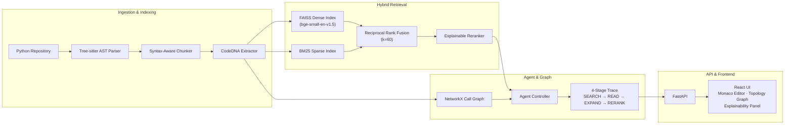

<p align="center">
  <strong>Samsung PRISM GenAI Hackathon 3.0 (2026–27)</strong><br/>
  Theme 1 — Agentic Code Architecture Intelligence
</p>

<h1 align="center">Agentic Code Intelligence Engine</h1>

<p align="center">
  A CPU-optimized, explainable code retrieval engine that combines AST-symbolic indexing,<br/>
  directed call-graph traversal, and hybrid dense-sparse search to locate, rank, and<br/>
  structurally verify code snippets across Python codebases.
</p>

<p align="center">
  
  
  
  
  
</p>

---


---

## Table of Contents

- [Problem Statement](#problem-statement)
- [Architecture](#architecture)
- [Key Features](#key-features)
- [Screenshots](#screenshots)
- [Video Demonstrations](#video-demonstrations)
- [Interactive Diagrams](#interactive-diagrams)
- [Tech Stack](#tech-stack)
- [Repository Structure](#repository-structure)
- [Getting Started](#getting-started)
- [API Reference](#api-reference)
- [Team](#team)

---

## Problem Statement

Large codebases overwhelm standard LLM context windows. Naive vector-based retrieval suffers from semantic drift and has no awareness of syntax boundaries, execution paths, or caller-callee hierarchies.

This project addresses the problem with a multi-stage retrieval architecture:

1. **AST-aware chunking** — code is split along syntactic boundaries (functions, classes, methods) using Tree-sitter, not arbitrary token windows.
2. **Hybrid retrieval** — dense semantic embeddings (FAISS) and sparse lexical matching (BM25) are fused via Reciprocal Rank Fusion.
3. **Graph reasoning** — a directed call graph (NetworkX) enables structural queries such as *"which functions call X before Y?"*
4. **Agentic workflow** — a bounded 4-stage state machine (`SEARCH → READ → EXPAND → RERANK`) iteratively follows dependency edges and verifies relevance.
5. **Explainability** — every result includes a factual evidence chain with per-factor score breakdowns and confidence levels.

---

## Architecture



> The three interactive HTML diagrams in `docs/diagrams/` provide detailed, zoomable views of this architecture. See [Interactive Diagrams](#interactive-diagrams) below.

---

## Key Features

### AST-Aware Parsing and Chunking

Code is parsed with **Tree-sitter** and chunked strictly along syntactic boundaries — functions, classes, and methods — rather than arbitrary token windows. Each chunk carries a **CodeDNA** fingerprint containing parameters, return types, call signatures, and import context.

### Hybrid Dense and Sparse Retrieval

The retrieval engine combines two indexes:

- **Dense** — `bge-small-en-v1.5` sentence embeddings indexed with `faiss-cpu` for semantic similarity.
- **Sparse** — `rank-bm25` lexical inverted index for exact keyword matching.
- **Fusion** — Reciprocal Rank Fusion (RRF, k=60) merges both ranked lists into a single result set, followed by an explainable multi-factor reranker.

### Call-Graph and Structural Reasoning

A **NetworkX DiGraph** models the codebase's caller-callee relationships. The structural query engine supports temporal ordering predicates — for example, finding all functions that call `sanitize_input` before `execute_query`. Resolution uses intra-procedural AST line checks (high confidence) with an inter-procedural graph reachability fallback.

### Agentic Retrieval Workflow

A bounded agent controller executes a 4-stage workflow:

```
SEARCH → READ → EXPAND → RERANK
```

Each stage is traced and displayed in the UI's timeline, providing full transparency into how results are discovered, expanded through dependency edges, and re-scored.

### Explainability

Every search result includes:

- **Score Breakdown** — individual Semantic, BM25, Symbol, and Graph scores.
- **Evidence Factors** — natural-language descriptions of why each factor contributed.
- **Confidence Level** — `HIGH`, `MEDIUM`, or `LOW` classification.
- **"Why This Result?"** — a dedicated UI modal with complete score attribution.

### Interactive Code Intelligence Cockpit

The React-based UI provides a three-panel split cockpit:

- **Search Results Panel** — ranked results with score breakdowns and the 4-stage agent trace timeline.
- **Topology Graph** — an interactive call-graph visualization (XY Flow) with zoom, pan, and node selection.
- **Monaco Code Viewer** — syntax-highlighted source display with automatic line-range focus on the selected result.

Two query modes are available via a mode switcher: **Hybrid Search** (semantic + lexical retrieval) and **AST Structural Query** (call-ordering verification).

### Repository Indexing

The engine can index any local **Python** repository at runtime via the `/api/repository/index` endpoint. Indexing builds the AST chunks, dense/sparse indexes, and call graph in a single pass. On failure, the previous working state is preserved via atomic rollback.

---

## Screenshots

### System Overview


*System-ready state after launch. Pipeline status indicator, mode selector, and empty canvas.*


*Three-panel cockpit: search results (left), topology graph (center), Monaco code viewer (right).*

### Hybrid Search


*Querying a real FastF1 telemetry codebase. Ranked results with per-factor score breakdowns.*


*Searching for lap-time extraction logic with hybrid dense + sparse retrieval.*

### Code Inspection and Explainability


*Monaco code viewer with syntax highlighting and the "Why This Result?" explainability panel.*


*Detailed 4-factor evidence breakdown: Semantic, BM25, Symbol, and Graph scoring.*

### Interactive Call Graph


*Interactive call-graph topology with caller-callee edges, zoom, and pan.*

### AST Structural Query


*Verifying call-ordering predicates ("calls X before Y") with structural evidence.*

<details>
<summary><strong>Additional Screenshots</strong> (click to expand)</summary>

<br/>


*Hybrid search for initialization and import patterns.*


*FastF1 cache management query with ranked results.*


*Viewing driver-retrieval logic with full score breakdown.*


*Line-range focused view of FastF1 cache access patterns.*


*In-graph node search for navigating large topologies.*


*Session and driver processing logic with evidence attribution.*


*Safety-wrapped telemetry retrieval with symbol and graph scores.*


*Telemetry data merge logic with timestamp alignment.*


*Graceful handling of queries unrelated to the indexed codebase.*

</details>

---

## Video Demonstrations

Three recorded walkthroughs are available in `docs/diagrams/Screenshots/`. GitHub does not embed `.mp4` videos inline — click the thumbnail to view or download the file.

### System Architecture Walkthrough

[](docs/diagrams/Screenshots/samsung-prism-agentic-code-intelligence-system.mp4)

Full walkthrough of the system architecture — all four pillars and their interconnections.

> [Download: `samsung-prism-agentic-code-intelligence-system.mp4`](docs/diagrams/Screenshots/samsung-prism-agentic-code-intelligence-system.mp4)

### Agent Workflow State Machine

[](docs/diagrams/Screenshots/agentic-code-intelligence-end-to-end-workflow-state-machine.mp4)

End-to-end agent execution from SEARCH through RERANK with trace visualization.

> [Download: `agentic-code-intelligence-end-to-end-workflow-state-machine.mp4`](docs/diagrams/Screenshots/agentic-code-intelligence-end-to-end-workflow-state-machine.mp4)

### Data Pipeline End-to-End

[](docs/diagrams/Screenshots/agentic-code-intelligence-end-to-end-data-pipeline.mp4)

Complete dataflow from AST parsing through fusion, agent reasoning, and React explainability rendering.

> [Download: `agentic-code-intelligence-end-to-end-data-pipeline.mp4`](docs/diagrams/Screenshots/agentic-code-intelligence-end-to-end-data-pipeline.mp4)

---

## Interactive Diagrams

The project includes three self-contained interactive HTML diagrams (generated with Archify). These files must be downloaded or cloned and opened locally in a browser — GitHub does not render interactive HTML inline.

| Diagram | Purpose | Path |
| :--- | :--- | :--- |
| **System Architecture** | Component wiring across all four pillars — parsing, retrieval, agent, and UI | [`architecture.html`](docs/diagrams/architecture.html) |
| **Agent State Machine** | Bounded 4-stage execution flow (SEARCH → READ → EXPAND → RERANK) | [`workflow.html`](docs/diagrams/workflow.html) |
| **Data Pipeline** | End-to-end dataflow from AST chunking through FAISS/BM25 indexes, RRF fusion, FastAPI, and React | [`dataflow.html`](docs/diagrams/dataflow.html) |

---

## Tech Stack

### Backend

| Component | Technology | Purpose |
| :--- | :--- | :--- |
| AST Parsing | `tree-sitter`, `tree-sitter-python` | Syntax-aware code chunking along function/class boundaries |
| Dense Embeddings | `sentence-transformers` (bge-small-en-v1.5) | Semantic vector representations |
| Dense Index | `faiss-cpu` | Approximate nearest-neighbor search |
| Sparse Index | `rank-bm25` | Lexical inverted index |
| Call Graph | `networkx` | Directed caller-callee graph traversal |
| REST API | `fastapi`, `uvicorn` | Async API server |
| Data Contracts | `pydantic` | Request/response validation |
| Testing | `pytest` | Unit and integration tests |

### Frontend

| Component | Technology | Purpose |
| :--- | :--- | :--- |
| Framework | React 19 | Component-based UI |
| Build Tool | Vite 8 | Dev server and bundler |
| Code Editor | `@monaco-editor/react` | Syntax-highlighted source viewer with line focus |
| Graph Visualization | `@xyflow/react` | Interactive node-edge topology with zoom and pan |

---

## Repository Structure

```text
├── agent/
│   ├── controller.py              # SEARCH → READ → EXPAND → RERANK state machine
│   └── tools.py                   # Agent tools wrapper
├── backend/
│   ├── app.py                     # FastAPI endpoints
│   └── schemas.py                 # Pydantic request/response contracts
├── demo_repo/                     # Synthetic e-commerce codebase (test target)
├── docs/
│   ├── diagrams/
│   │   ├── Screenshots/           # 17 annotated screenshots + 3 demo videos
│   │   ├── architecture.html      # Interactive system architecture diagram
│   │   ├── workflow.html          # Interactive agent state-machine diagram
│   │   └── dataflow.html         # Interactive data-pipeline diagram
│   ├── PARSER_DEMO.md
│   └── PARSER_INTEGRATION.md
├── evaluation/
│   ├── evaluate_pipeline.py       # Benchmark runner
│   └── eval_results.json          # Evaluation metrics
├── frontend/
│   └── src/
│       ├── App.jsx                # Main search, trace timeline, code inspector
│       └── components/
│           ├── ArchitectureGraph.jsx  # XY Flow topology graph
│           └── WhyThisResult.jsx     # Explainability modal
├── graph/
│   └── call_graph.py              # NetworkX DiGraph builder
├── indexing/
│   ├── code_dna.py                # AST symbol metadata extraction
│   └── version_manager.py         # Codebase diffing and incremental indexing
├── parser/
│   ├── ast_parser.py              # Tree-sitter AST visitor
│   └── chunker.py                 # Boundary-aware chunker
├── retrieval/
│   ├── dense_search.py            # FAISS vector index
│   ├── sparse_search.py           # BM25 lexical index
│   ├── fusion.py                  # Reciprocal Rank Fusion (k=60)
│   ├── reranker.py                # Multi-factor explainable reranker
│   ├── engine.py                  # Unified retrieval orchestrator
│   └── structural.py             # Structural ordering query engine
├── scripts/                       # Diagram generators and micro-benchmarks
├── Implementation Plans/          # Per-member implementation plans
├── pipeline_wiring.py             # Master pipeline: scan, index, agent cache
├── run.bat                        # One-click Windows launcher
└── requirements.txt
```

---

## Getting Started

### Prerequisites

- Python 3.10+
- Node.js 18+ and npm
- Git

### 1. Clone the Repository

```bash
git clone https://github.com/Heytish-V/Samsung_Agentic_Code_Workflow.git
cd Samsung_Agentic_Code_Workflow
```

### 2. Set Up the Python Backend

```bash
# Create a virtual environment
python -m venv .venv

# Activate it (Windows)
.venv\Scripts\activate

# Activate it (macOS / Linux)
# source .venv/bin/activate

# Install dependencies
pip install -r requirements.txt
```

### 3. Set Up the Frontend

```bash
cd frontend
npm install
cd ..
```

### 4. Launch the Application

**Windows (one-click)** — double-click `run.bat` or run:

```bash
.\run.bat
```

This starts the FastAPI backend on `http://127.0.0.1:8000` and the Vite dev server on `http://localhost:5173`, then opens the UI in your default browser.

**Manual launch (any platform):**

```bash
# Terminal 1 — Backend
python -m uvicorn backend.app:app --host 127.0.0.1 --port 8000 --reload

# Terminal 2 — Frontend
cd frontend
npm run dev
```

### 5. Index a Custom Repository

Once running, index any local Python repository:

```bash
curl -X POST http://127.0.0.1:8000/api/repository/index ^
  -H "Content-Type: application/json" ^
  -d "{\"repo_path\": \"C:/path/to/your/repo\"}"
```

Or use the Swagger UI at [http://127.0.0.1:8000/docs](http://127.0.0.1:8000/docs).

---

## API Reference

Base URL: `http://127.0.0.1:8000`

| Method | Endpoint | Purpose |
| :--- | :--- | :--- |
| `GET` | `/` | Redirects to Swagger API documentation |
| `GET` | `/api/health` | Pipeline health check — status, chunk count, graph stats |
| `POST` | `/api/repository/index` | Index a local Python repository |
| `POST` | `/api/search` | Hybrid search with 4-stage agentic retrieval |
| `POST` | `/api/structural-query` | AST structural call-ordering verification |
| `GET` | `/api/graph/subgraph` | Call-graph neighborhood for topology visualization |

### POST `/api/search`

```json
{
  "query": "Where is user authentication token validated?",
  "top_k": 5,
  "enable_agent": true
}
```

Returns ranked `results` (with `chunk_id`, `file`, `symbol`, `code`, `final_score`, `score_breakdown`, `why_matched`, `evidence`, `confidence_level`) and `agent_trace` (array of `step`, `tool`, `result` entries).

### POST `/api/structural-query`

```json
{
  "func_before": "sanitize_input",
  "func_after": "execute_query"
}
```

Returns a `predicate` string and `matches` — each containing `caller`, `file`, `start_line`, `end_line`, `line_x`, `line_y`, `evidence`, and `confidence`.

### POST `/api/repository/index`

```json
{
  "repo_path": "C:/Users/Projects/MyRepo"
}
```

Returns `repo_path`, `chunks_indexed`, `graph_nodes`, `graph_edges`, and `status`.

### GET `/api/graph/subgraph`

Query parameters: `chunk_id` (required), `depth` (1–3, default 2).

Returns `center_id`, `nodes` (id, symbol, file, is_external, node_type, start_line, end_line), and `edges` (source, target, call_type).

---

## Team

| Member | Focus Area | Deliverables |
| :--- | :--- | :--- |
| **Heytish** | Integration & Agent Graph | Agent Controller, NetworkX Call Graph, Structural Query Engine, Pipeline Wiring ([Plan](Implementation%20Plans/HEYTISH_INTEGRATION_AGENT.md)) |
| **Nived** | Parser & AST Indexing | Tree-sitter Parser, CodeDNA Extractor, AST Chunker ([Plan](Implementation%20Plans/NIVED_PARSER_AST_INDEXING.md)) |
| **Mithun** | Retrieval & ML Core | FAISS Dense Index, BM25 Sparse Index, RRF Fusion, Explainable Reranker ([Plan](Implementation%20Plans/MITHUN_RETRIEVAL_ML_CORE.md)) |
| **Durga** | API & Frontend UI | FastAPI Endpoints, React UI, "Why This Result?" Explainability, Evaluation Suite ([Plan](Implementation%20Plans/DURGA_FRONTEND_API_EVALUATION.md)) |

---

<p align="center">
  <strong>Samsung PRISM</strong> · Theme 1 · Agentic Code Architecture Intelligence<br/>
  <sub>Developed as part of the Samsung PRISM GenAI Hackathon 3.0 (2026–27). All rights reserved by the respective team members and Samsung Research.</sub>
</p>
